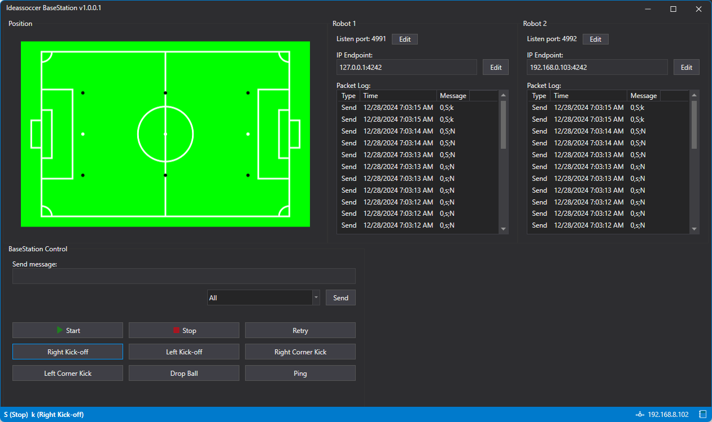

+++
title = "Ideassoccer BaseStation"
date = "2023-03-18"
description = "A station control for wheeled soccer robots."
link = "https://github.com/haruaki07/Ideassoccer-BaseStation"
type = "project"
+++

Station control for wheeled soccer robots, that can control and monitor state and movement, also a referee box intermediary. It uses UDP to communicate with microcontroller on robots. Built with .NET WPF.

